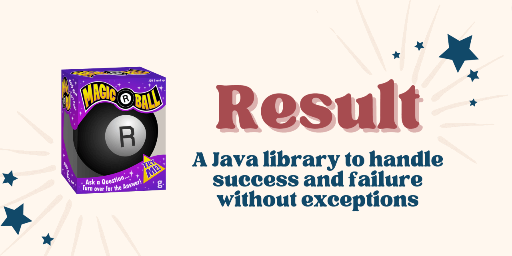

[![Build Status][BADGE_BUILD_STATUS]][BUILD_STATUS]
[![Quality Gate Status][BADGE_QUALITY_GATE]][QUALITY_GATE]
[![Coverage][BADGE_CODE_COVERAGE]][CODE_COVERAGE]
[![Maven Central][BADGE_ARTIFACTS]][ARTIFACTS]
[![Latest Release][BADGE_LATEST_RELEASE]][LATEST_RELEASE]
[![Javadoc][BADGE_JAVADOC]][JAVADOC]



> *If you seek advice... then this Java library is for you! `Result` objects have all the answers you need. Start by
> "asking the ball" a Yes or No question, then turn it over and let the answers magically appear. Results can be either
> positive ("Success") or negative ("Failure"). Great fun for software developers and adults alike. Colors and
> decorations may vary.*

# Result Library for Java

The purpose of this library is to provide a type-safe encapsulation of operation results that may have succeeded or
failed, instead of throwing exceptions.

If you like `Optional` but feel that it sometimes falls too short, you'll love `Result`.

The best way to think of _Result_ is as a super-powered version of _Optional_. The only difference is that whereas
_Optional_ may contain a successful value or express the absence of a value, _Result_ contains either a successful value
or a failure value that explains what went wrong.

<details style="margin-bottom: 20px">
 <summary style="display: list-item"><code>Result</code> objects have methods equivalent to those in
 <code>Optional</code>, plus a few more to handle failure values.</summary>
 <div markdown="1">

| Optional                | Result                  |
|-------------------------|-------------------------|
| `isPresent`             | `hasSuccess`            |
| `isEmpty`               | `hasFailure`            |
| `get`                   | `getSuccess`            |
|                         | `getFailure`            |
| `orElse`                | `orElse`                |
| `orElseGet`             | `orElseMap`             |
| `orElseThrow`           |                         |
| `stream`                | `streamSuccess`         |
|                         | `streamFailure`         |
| `ifPresent`             | `ifSuccess`             |
|                         | `ifFailure`             |
| `ifPresentOrElse`       | `ifSuccessOrElse`       |
| `filter`                | `filter`                |
|                         | `recover`               |
| `map`                   | `mapSuccess`            |
|                         | `mapFailure`            |
|                         | `map`                   |
| `flatMap`               | `flatMapSuccess`        |
| `or`                    | `flatMapFailure`        |
|                         | `flatMap`               |

 </div>
</details>

---


## Result Library in a Nutshell

Before _Result_, we would wrap exception-throwing `foobar` method invocation inside a `try` block so that errors can be
handled inside a `catch` block.

```java

public int getFoobarLength() {
    int length;
    try {
        final String result = foobar();
        this.commit(result);
        length = result.length();
    } catch(SomeException problem) {
        this.rollback(problem);
        length = -1;
    }
    return length;
}

```

This approach is lengthy, and that's not the only problem -- it's also slow. Conventional wisdom says that exceptional
logic shouldn't be used for normal program flow. _Result_ makes us deal with expected, non-exceptional error situations
explicitly as a way of enforcing good programming practices.

Let's now look at how the above code could be refactored if method `foobar` returned a _Result_ object instead of
throwing an exception:

```java

public int getFoobarLength() {
    final Result<String, SomeFailure> result = foobar();
    result.ifSuccessOrElse(this::commit, this::rollback);
    final Result<Integer, SomeFailure> resultLength = result.mapSuccess(String::length);
    return resultLength.orElse(-1);
}

```

In the above example, we use only four lines of code to replace the ten that worked in the first example. But we can
make it even shorter by chaining methods in typical functional programming style:

```java

public int getFoobarLength() {
    return foobar().ifSuccessOrElse(this::commit, this::rollback).mapSuccess(String::length).orElse(-1);
}

```

In fact, since we are using `-1` here just to signal that the underlying operation failed, we'd be better off returning
a _Result_ object upstream:

```java

public Result<Integer, SomeFailure> getFoobarLength() {
    return foobar().ifSuccessOrElse(this::commit, this::rollback).mapSuccess(String::length);
}

```

This allows others to easily compose operations on top of ours, just like we did with `foobar`.


## Getting Started

Please read the [Quick Guide][QUICK_GUIDE] to know how to add this library to your build.


## Releases

This library adheres to [Pragmatic Versioning][PRAGVER].

Artifacts are available in [Maven Central][ARTIFACTS].


## Javadoc

Here you can find the full [Javadoc documentation][JAVADOC].


## Looking for Support?

We'd love to help. Check out the [support guidelines][SUPPORT].


## Contributions Welcome

If you'd like to contribute to this project, please [start here][CONTRIBUTING].


## Code of Conduct

This project is governed by the [Contributor Covenant Code of Conduct][CODE_OF_CONDUCT].
By participating, you are expected to uphold this code.


## Author

Copyright 2023 [Guillermo Calvo][AUTHOR].

[![][GUILLERMO_IMAGE]][GUILLERMO]


## License

This library is licensed under the *Apache License, Version 2.0* (the "License");
you may not use it except in compliance with the License.

You may obtain a copy of the License at <http://www.apache.org/licenses/LICENSE-2.0>

Unless required by applicable law or agreed to in writing, software distributed under the License
is distributed on an "AS IS" BASIS, **WITHOUT WARRANTIES OR CONDITIONS OF ANY KIND**, either express or implied.

See the License for the specific language governing permissions and limitations under the License.


**Permitted:**

- **Commercial Use**: You may use this library and derivatives for commercial purposes.
- **Modification**: You may modify this library.
- **Distribution**: You may distribute this library.
- **Patent Use**: This license provides an express grant of patent rights from contributors.
- **Private Use**: You may use and modify this library without distributing it.

**Required:**

- **License and Copyright Notice**: If you distribute this library you must include a copy of the license and copyright
  notice.
- **State Changes**: If you modify and distribute this library you must document changes made to this library.

**Forbidden:**

- **Trademark use**: This license does not grant any trademark rights.
- **Liability**: The library author cannot be held liable for damages.
- **Warranty**: This library is provided without any warranty.


[ARTIFACTS]:                    https://search.maven.org/artifact/com.leakyabstractions/result/
[AUTHOR]:                       https://github.com/guillermocalvo/
[BADGE_ARTIFACTS]:              https://img.shields.io/endpoint?url=https://dev.leakyabstractions.com/result/badge.json&logo=java&label=maven-central&labelColor=555
[BADGE_BUILD_STATUS]:           https://github.com/leakyabstractions/result/workflows/Build/badge.svg
[BADGE_CODE_COVERAGE]:          https://sonarcloud.io/api/project_badges/measure?project=LeakyAbstractions_result&metric=coverage
[BADGE_JAVADOC]:                https://img.shields.io/endpoint?url=https://dev.leakyabstractions.com/result/badge.json&label=javadoc&color=blue
[BADGE_LATEST_RELEASE]:         https://img.shields.io/github/release/leakyabstractions/result.svg?logo=github
[BADGE_QUALITY_GATE]:           https://sonarcloud.io/api/project_badges/measure?project=LeakyAbstractions_result&metric=alert_status
[BUILD_STATUS]:                 https://github.com/LeakyAbstractions/result/actions?query=workflow%3ABuild
[CODE_COVERAGE]:                https://sonarcloud.io/component_measures?id=LeakyAbstractions_result&metric=coverage&view=list
[CODE_OF_CONDUCT]:              https://dev.leakyabstractions.com/result/CODE_OF_CONDUCT.html
[CONTRIBUTING]:                 https://dev.leakyabstractions.com/result/CONTRIBUTING.html
[GUILLERMO]:                    https://guillermo.dev/
[GUILLERMO_IMAGE]:              https://guillermo.dev/assets/images/thumb.png
[JAVADOC]:                      https://dev.leakyabstractions.com/result/javadoc/
[LATEST_RELEASE]:               https://github.com/leakyabstractions/result/releases/latest/
[PRAGVER]:                      https://pragver.github.io/
[QUALITY_GATE]:                 https://sonarcloud.io/dashboard?id=LeakyAbstractions_result
[QUICK_GUIDE]:                  https://dev.leakyabstractions.com/result/
[SUPPORT]:                      https://dev.leakyabstractions.com/result/SUPPORT.html
