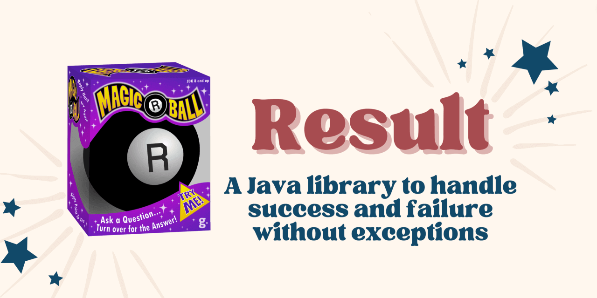

> *If you seek advice... then this Java library is for you! `Result` objects have all the answers you need. Start by
> "asking the ball" a Yes or No question, then turn it over and let the answers magically appear. Results can be either
> positive ("Success") or negative ("Failure"). Great fun for software developers and adults alike. Colors and
> decorations may vary.*

# Getting Started

Instances of `Result` represent either the *success* or *failure* of an operation.

Result objects are immutable and type-safe. Operations that succeed produce results encapsulating a success value;
operations that fail produce results with a failure value.

Treating failed operations as regular values allows for a functional approach to error handling -- instead of throwing
exceptions and using try-catch blocks. In terms of functional programming, `Result` is just a monadic container type.

The best way to think of `Result` is as a super-powered version of `Optional`. The only difference is that, whereas
`Optional` may contain a value or be _empty_, `Result` contains either a _success_ value or a _failure_ value.

## Creating Result Objects

- [`Results.success`][NEW_SUCCESS]
  creates a new successful result containing the given value.
- [`Results.failure`][NEW_FAILURE]
  creates a new failed result containing the given value.
- [`Results.ofNullable`][OF_NULLABLE]
  creates a new result based on the given possibly-null value.
- [`Results.ofOptional`][OF_OPTIONAL]
  creates a new result based on the given possibly-empty optional.
- [`Results.ofCallable`][OF_CALLABLE]
  creates a new result based on the given possibly-throwing task.

# Basic Usage

## Unwrapping Values

- [`hasSuccess`][HAS_SUCCESS]
  checks if a result contains a success value.
- [`hasFailure`][HAS_FAILURE]
  checks if a result contains a failure value.
- [`getSuccess`][GET_SUCCESS]
  returns a result's success value as a possibly-empty optional.
- [`getFailure`][GET_FAILURE]
  returns a result's failure value as a possibly-empty optional.
- [`orElse`][OR_ELSE]
  returns a result's success value, or the given one.
- [`orElseMap`][OR_ELSE_MAP]
  returns a result's success value, or maps its failure value.
- [`streamSuccess`][STREAM_SUCCESS]
  returns a result's success value as a possibly-empty stream.
- [`streamFailure`][STREAM_FAILURE]
  returns a result's failure value as a possibly-empty stream.

## Conditional Actions

- [`ifSuccess`][IF_SUCCESS]
  performs the given action with a successful result's value.
- [`ifFailure`][IF_FAILURE]
  performs the given action with a failed result's value.
- [`ifSuccessOrElse`][IF_SUCCESS_OR_ELSE]
  performs either of the given actions with a result's value.

# Advanced Usage

## Screening Results

- [`filter`][FILTER]
  transforms a successful result into a failed one, based on the given condition.
- [`recover`][RECOVER]
  transforms a failed result into a successful one, based on the given condition.

## Transforming Values

- [`mapSuccess`][MAP_SUCCESS]
  transform the value of a successful result.
- [`mapFailure`][MAP_FAILURE]
  transform the value of a failed result.
- [`map`][MAP]
  transforms either the success or the failure value of a result.
- [`flatMapSuccess`][FLATMAP_SUCCESS]
  transforms a successful result into a different one.
- [`flatMapFailure`][FLATMAP_FAILURE]
  transforms a failed result into a different one.
- [`flatMap`][FLATMAP]
  transforms a result into a different one.

# Additional Info

Here's the full [Result API documentation][JAVADOC].

## Releases

This library adheres to [Pragmatic Versioning][PRAGVER].

Artifacts are available in [Maven Central][MAVEN_CENTRAL].

- Group ID: `com.leakyabstractions`
- Artifact ID: `result`
- Version: `{{ site.current_version }}`

## Looking for Support?

We'd love to help. Check out the [support guidelines](SUPPORT.md).

## Contributions Welcome

If you'd like to contribute to this project, please [start here](CONTRIBUTING.md).

This project is governed by the [Contributor Covenant Code of Conduct](CODE_OF_CONDUCT.md). By participating, you are
expected to uphold this code.

[NEW_SUCCESS]: https://dev.leakyabstractions.com/result/javadoc/{{ site.current_version }}/com/leakyabstractions/result/Results.html#success-S-
[NEW_FAILURE]: https://dev.leakyabstractions.com/result/javadoc/{{ site.current_version }}/com/leakyabstractions/result/Results.html#failure-F-
[OF_NULLABLE]: https://dev.leakyabstractions.com/result/javadoc/{{ site.current_version }}/com/leakyabstractions/result/Results.html#ofNullable-S-F-
[OF_OPTIONAL]: https://dev.leakyabstractions.com/result/javadoc/{{ site.current_version }}/com/leakyabstractions/result/Results.html#ofOptional-java.util.Optional-F-
[OF_CALLABLE]: https://dev.leakyabstractions.com/result/javadoc/{{ site.current_version }}/com/leakyabstractions/result/Results.html#ofCallable-java.util.concurrent.Callable-
[HAS_SUCCESS]: https://dev.leakyabstractions.com/result/javadoc/{{ site.current_version }}/com/leakyabstractions/result/Result.html#hasSuccess--
[HAS_FAILURE]: https://dev.leakyabstractions.com/result/javadoc/{{ site.current_version }}/com/leakyabstractions/result/Result.html#hasFailure--
[GET_SUCCESS]: https://dev.leakyabstractions.com/result/javadoc/{{ site.current_version }}/com/leakyabstractions/result/Result.html#getSuccess--
[GET_FAILURE]: https://dev.leakyabstractions.com/result/javadoc/{{ site.current_version }}/com/leakyabstractions/result/Result.html#getFailure--
[OR_ELSE]: https://dev.leakyabstractions.com/result/javadoc/{{ site.current_version }}/com/leakyabstractions/result/Result.html#orElse-S-
[OR_ELSE_MAP]: https://dev.leakyabstractions.com/result/javadoc/{{ site.current_version }}/com/leakyabstractions/result/Result.html#orElseMap-java.util.function.Function-
[STREAM_SUCCESS]: https://dev.leakyabstractions.com/result/javadoc/{{ site.current_version }}/com/leakyabstractions/result/Result.html#streamSuccess--
[STREAM_FAILURE]: https://dev.leakyabstractions.com/result/javadoc/{{ site.current_version }}/com/leakyabstractions/result/Result.html#streamFailure--
[IF_SUCCESS]: https://dev.leakyabstractions.com/result/javadoc/{{ site.current_version }}/com/leakyabstractions/result/Result.html#ifSuccess-java.util.function.Consumer-
[IF_FAILURE]: https://dev.leakyabstractions.com/result/javadoc/{{ site.current_version }}/com/leakyabstractions/result/Result.html#ifFailure-java.util.function.Consumer-
[IF_SUCCESS_OR_ELSE]: https://dev.leakyabstractions.com/result/javadoc/{{ site.current_version }}/com/leakyabstractions/result/Result.html#ifSuccessOrElse-java.util.function.Consumer,java.util.function.Consumer-
[FILTER]: https://dev.leakyabstractions.com/result/javadoc/{{ site.current_version }}/com/leakyabstractions/result/Result.html#filter-java.util.function.Predicate,java.util.function.Function-
[RECOVER]: https://dev.leakyabstractions.com/result/javadoc/{{ site.current_version }}/com/leakyabstractions/result/Result.html#recover-java.util.function.Predicate,java.util.function.Function-
[MAP]: https://dev.leakyabstractions.com/result/javadoc/{{ site.current_version }}/com/leakyabstractions/result/Result.html#map-java.util.function.Function,java.util.function.Function-
[MAP_SUCCESS]: https://dev.leakyabstractions.com/result/javadoc/{{ site.current_version }}/com/leakyabstractions/result/Result.html#mapSuccess-java.util.function.Function-
[MAP_FAILURE]: https://dev.leakyabstractions.com/result/javadoc/{{ site.current_version }}/com/leakyabstractions/result/Result.html#mapFailure-java.util.function.Function-
[FLATMAP]: https://dev.leakyabstractions.com/result/javadoc/{{ site.current_version }}/com/leakyabstractions/result/Result.html#flatMap-java.util.function.Function,java.util.function.Function-
[FLATMAP_SUCCESS]: https://dev.leakyabstractions.com/result/javadoc/{{ site.current_version }}/com/leakyabstractions/result/Result.html#flatMapSuccess-java.util.function.Function-
[FLATMAP_FAILURE]: https://dev.leakyabstractions.com/result/javadoc/{{ site.current_version }}/com/leakyabstractions/result/Result.html#flatMapFailure-java.util.function.Function-
[JAVADOC]: https://dev.leakyabstractions.com/result/javadoc/{{ site.current_version }}/
[PRAGVER]: https://pragver.github.io/
[MAVEN_CENTRAL]: https://search.maven.org/artifact/com.leakyabstractions/result
